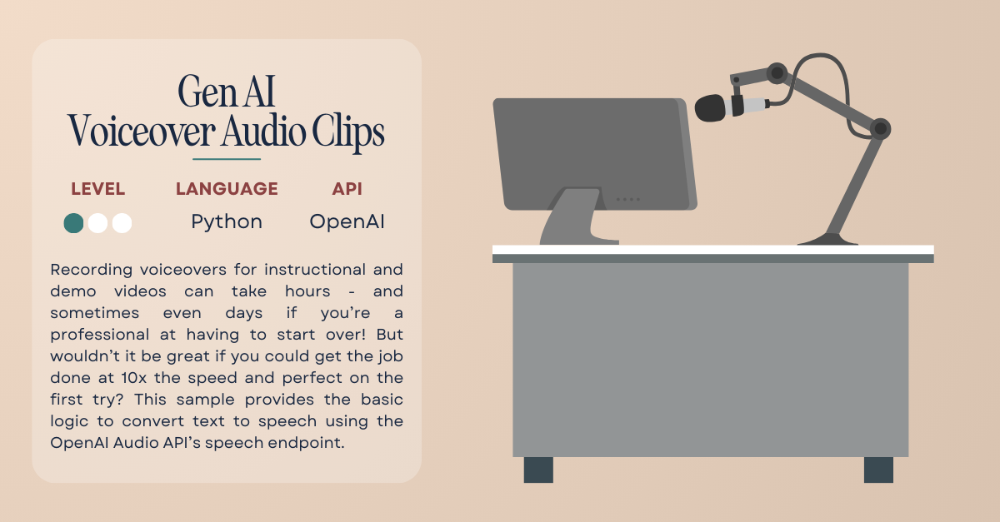

# 
Voiceover Audio Clips

Recording voiceovers for instructional and demo videos can take hours - and sometimes even days if you’re a professional at having to start over! But wouldn’t it be great if you could get the job done at 10x the speed and perfect on the first try? This sample provides the basic logic to convert text to speech using the OpenAI Audio API’s speech endpoint. Gone are the days of hours at the microphone!

## ✅ Requirements

- [OpenAI API](https://platform.openai.com/signup) access
- Code editor ([Visual Studio Code](https://code.visualstudio.com/) is always a fabulous choice!)

## 📚 Tutorial

The written tutorial for this sample will be available soon!

## 📦 Resources

- [OpenAI Developer Docs](https://platform.openai.com/docs/overview)

## 🚨 Contact

Have a question or issue trying the sample? Submit an issue to the repo!
